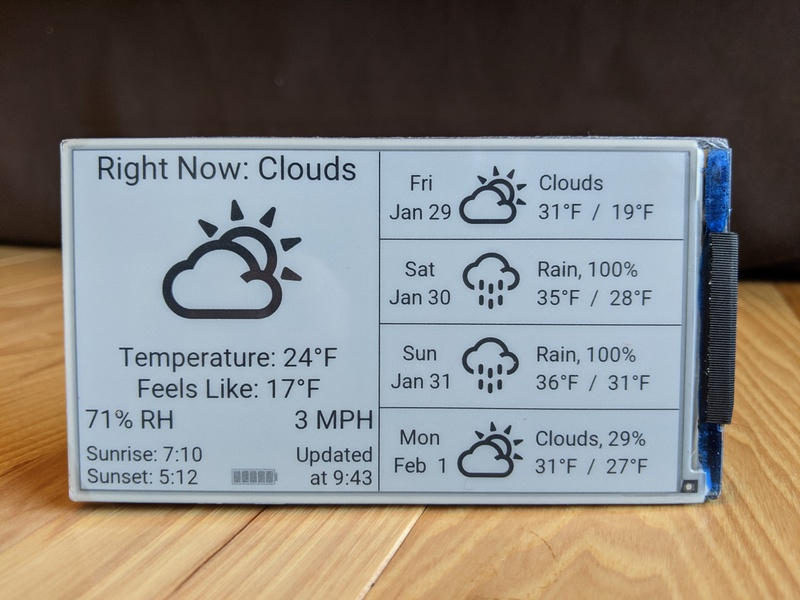
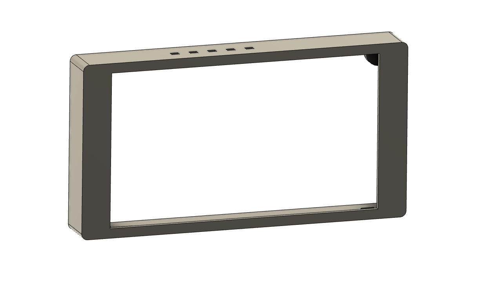
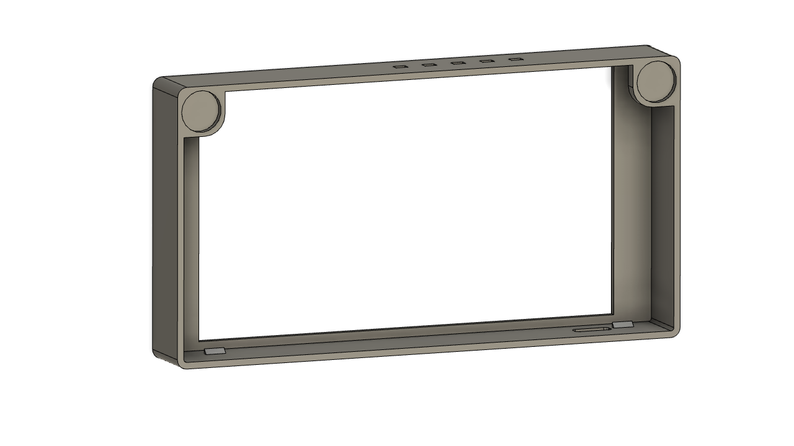

# Weather_EPD47

Weather display for the [LilyGo 4.7" ePaper display with ESP32](https://github.com/Xinyuan-LilyGO/LilyGo-EPD47) using libraries from vroland's [epdiy project](https://github.com/vroland/epdiy/tree/master/examples/weather/) (thanks!) and the Arduino IDE.  Set up your board in the Arduino IDE using LilyGo's instructions.

Make sure to update the config.h file with your wifi credentials, OpenWeatherMap API key, and regional settings (timezone, imperial/metric, and string translations).

*Update 2021-02-02:* Added lunar phases icons

*Update 2021-02-01:* I've added a simple, [one-piece case design for 3D printing](EPD47-Case.stl).  Print face down, and for best results, print using tree supports touching the build plate only.  For mounting on metallic surfaces such as a refrigerator, this uses 2 neodymium magnets of size 10x2 mm (10mm diameter, 2mm thick... mine actually measured 9.5mm x 1.8mm).  This case is thin enough to support lipo cells, but not the 18650s.

